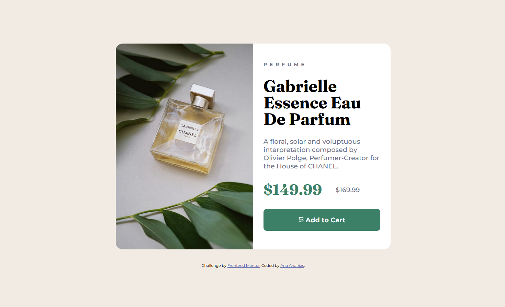
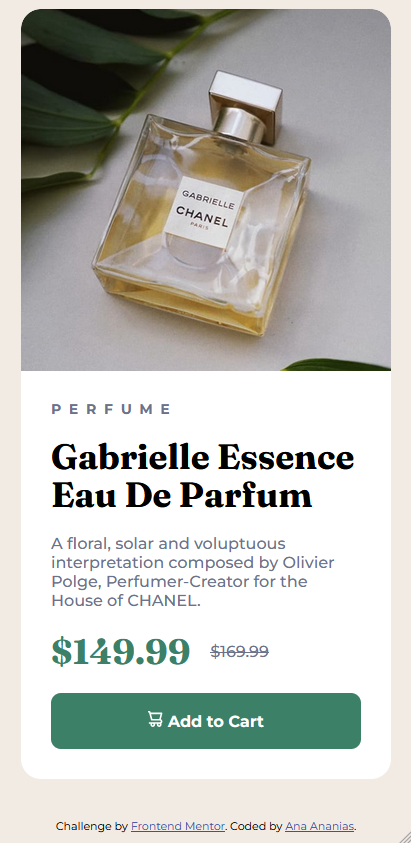

# Product Preview Card 🔗


> Componente de card de produto responsivo desenvolvido a partir de um desafio do Frontend Mentor, com foco em mobile-first e técnicas modernas de layout em CSS.

🔗 Desafio original: https://www.frontendmentor.io/challenges/product-preview-card-component-GO7UmttRfa

### ✨ [Veja o site ao vivo aqui!](https://anaflgg.github.io/product-preview-card/)

---

### 📸 Screenshot




---

### 📖 Sobre o Projeto

Este projeto consiste em um card de produto responsivo, baseado em um desafio do Frontend Mentor.

O principal objetivo foi praticar o desenvolvimento mobile-first e entender como adaptar layouts para diferentes tamanhos de tela utilizando media queries.

---

### 🚀 Tecnologias Utilizadas

- HTML5
- CSS3
- Flexbox
- Media Queries
- Google Fonts (Montserrat + Fraunces)

---

### 🧠 Aprendizados

- Aplicação da abordagem mobile-first com @media (min-width)
- Estruturação de layout utilizando Flexbox
- Adaptação de imagens para diferentes tamanhos de tela
- Uso de overflow: hidden para manter o border-radius consistente

---

### 🐛 Desafios e Soluções

Identifiquei um pequeno espaço abaixo da imagem causado pelo comportamento padrão inline da tag ``.

Resolvido com:

```css
.img-perfume img {
  display: block;
}
```

- Primeira implementação prática de responsividade utilizando @media, incluindo mudança de layout e adaptação de imagens para diferentes resoluções.

---

### 🔮 Melhorias futuras

- Adicionar interatividade com JavaScript
- Melhorar acessibilidade
- Implementar animações simples

---

### 👷 Como executar o projeto

Este é um projeto estático, não precisa instalar nada.

1. Clone o repositório:
```bash
git clone https://github.com/anaflgg/product-preview-card.git